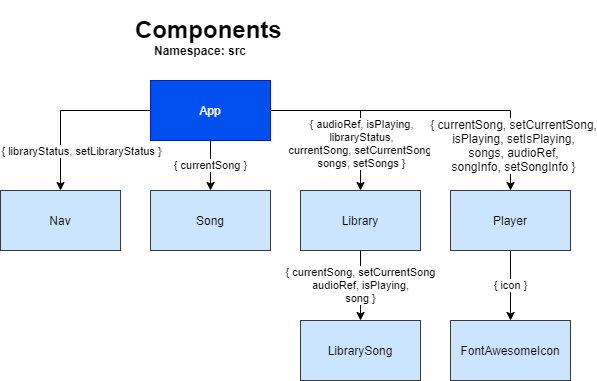

[English](README.md)

# HotLink Beats

Un elegante reproductor de música creado con React.js y con Sass.


## Plantilla

Este proyecto arrancó de la plantilla [Create React App](https://github.com/facebook/create-react-app).

## Usar este proyecto

1. Clonar el repositorio remoto a tu repositorio local. `git clone https://github.com/hdevilbiss/react-music-player.git`
1. Muévete hacía la carpeta creada. `cd react-music-player`
1. Instala las dependencias de Node. `npm i`
1. Crea el servidor local. `npm start`

## Detrás de escenas

### Información

La información detrás de cada canción y el arte está contenido en un array de objetos en `src/data.js`. Este archivo se importa por `App.jsx`: el valor importado es una función, la cual es invocada cuando es usada como el valor inicial para el estado `songs`.

```jsx
import { useRef, useState } from "react";
import data from "./data";
function App() {
    // ...
    const [songs, setSongs] = useState(data());
    //...
}
```

### Componentes





Todos los componentes heredan desde el componente raíz, `App`.

El componente `Nav` muestra la cabecera (header), y el interruptor (toggler) para abrir y cerrar `Library`.

El componente `Song` muestra el arte, el nombre de la canción, el artista para el estado de `currentSong`.

El componente `Library` muestra varios componentes de `LibrarySong`. La lista de componentes `LibrarySong` muestra el arte, nombre de la canción, y el artista para cada canción en el archivo `data.js`.

El componente `Player` tiene los íconos los cuales son utilizados para regresar la canción, play, pausa y siguiente canción. Tiene componentes de `FontAwesomeIcon` como su interfaz de usuario.
