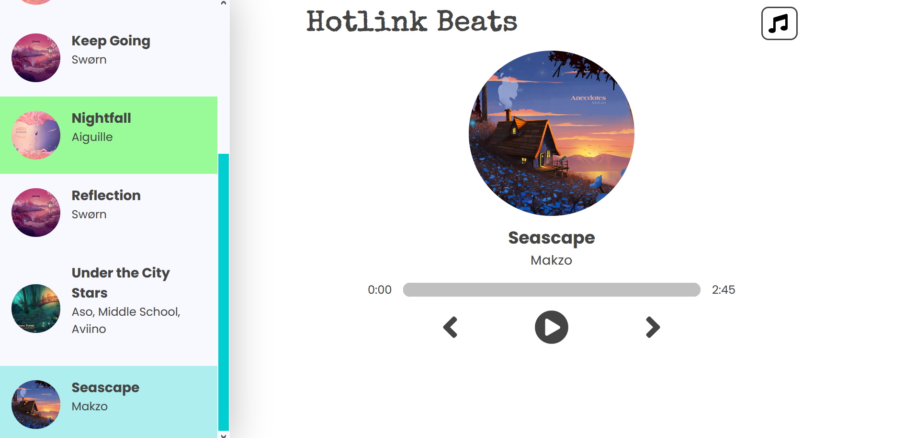
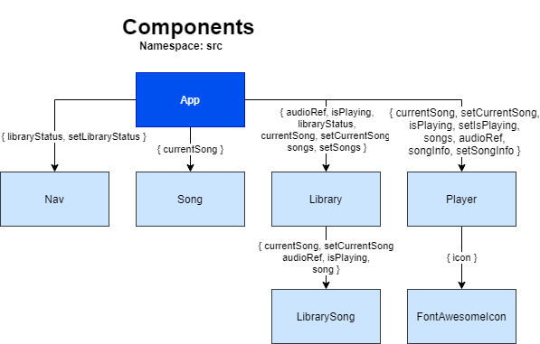

[Español](README-ESP.md)

# HotLink Beats

A stylish music player built with React.js and styled with Sass.



## Boilerplate

This project was scaffolded from the [Create React App](https://github.com/facebook/create-react-app) boilerplate.

## Using the project

1. Clone the remote into a local repo. `git clone https://github.com/hdevilbiss/react-music-player.git`
1. Move into the newly created folder. `cd react-music-player`
1. Install the node dependencies. `npm i`
1. Create a local server. `npm start`

## Behind the scenes

### Data

The data behind the songs and cover art is contained in an array of objects under `src/data.js`. This file gets imported by `App.jsx`: the import value is a function, which gets invoked when used as the initial value for the `songs` state.

```jsx
import { useRef, useState } from "react";
import data from "./data";
function App() {
    // ...
    const [songs, setSongs] = useState(data());
    //...
}
```

### Components

🚧



All components inherit from the root component, `App`.

The `Nav` component displays a header, and toggler to open and close the `Library`.

The `Song` component displays the cover art, song name, and artist for the `currentSong` state.

The `Library` component displays several `LibrarySong` components. The `LibrarySong` components list out the cover art, song name, and artist for each song in the `data.js` file.

The `Player` component has the icons which can be used to rewind to the previous, play, pause, and fast forward to the next song. It has `FontAwesomeIcon` components as the user interface.
